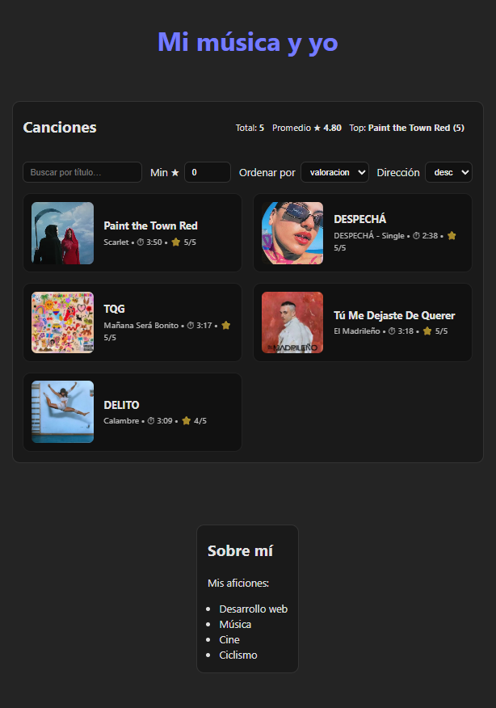

# 🎵 React Canciones

Aplicación en **React** que muestra una lista de canciones favoritas y algunas estadísticas básicas (valoración, duración, canción destacada…).  
El proyecto también incluye una sección personal sobre aficiones.

---

## ✨ Características

- Carga de canciones desde un archivo JSON (`public/canciones.json`).
- Visualización de:
  - Título
  - Álbum
  - Portada
  - Duración
  - Valoración
- Filtros y ordenación:
  - Buscar por título
  - Filtrar por valoración mínima
  - Ordenar por título, álbum, duración o valoración
- Estadísticas automáticas:
  - Total de canciones
  - Promedio de valoraciones
  - Canción con mejor puntuación
- Sección extra con información personal y aficiones.

---

## 📂 Estructura

```
react_canciones/
├─ public/
│  ├─ canciones.json
│  └─ images/
├─ src/
│  ├─ components/
│  │  ├─ CancionesAnalytics/
│  │  │  ├─ CancionesAnalytics.jsx
│  │  │  └─ CancionesAnalytics.css
│  │  └─ Hobbies/
│  │     ├─ Hobbies.jsx
│  │     └─ Hobbies.css
│  ├─ App.jsx
│  ├─ App.css
│  ├─ index.css
│  └─ main.jsx
└─ package.json
```

---

## 🚀 Instalación y ejecución

1. Clona el repositorio:
   
   ```bash
   git clone https://github.com/arni91/react_canciones.git
   cd react_canciones

2. Instala dependencias:
    ```bash
    npm install

3. Arranca el servidor de desarrollo: 
    ```bash
    npm run dev

4. Abre el navegador:
    ```bash
    http://localhost:5173/

---

## 🛠️ Tecnologías usadas

. React

. Vite

. CSS

---

## 📸 Captura de pantalla



---

## 👤 Autor

Arnau Marí
: 💼 Ingeniero Industrial & Estudiante de Desarrollo Web

---
